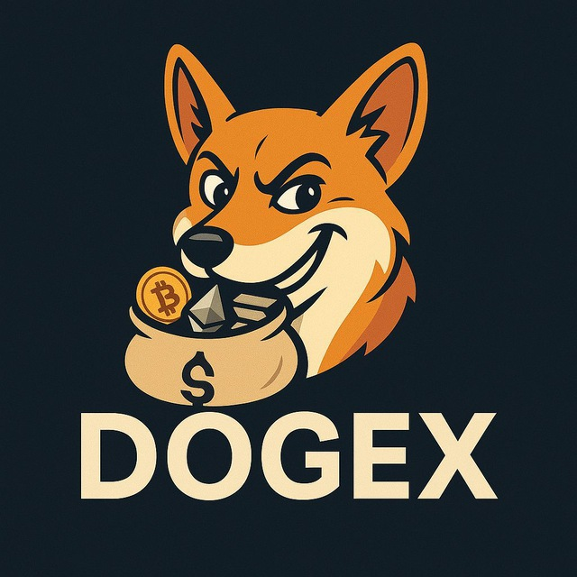

# DOGEX Interface 🐕

> **Advanced DeFi Trading Interface for Leveraged DOGE Positions**

A cutting-edge Web3 interface built for the DOGEX protocol, enabling users to trade leveraged positions on DOGE with up to 100x leverage. Features an AI-powered trading companion, seamless USDC integration, and real-time position management.



## 🚀 Features

### 🎯 **Core Trading**
- **Leveraged Trading**: 10x to 100x leverage on DOGE positions
- **Long & Short Positions**: Full directional trading capabilities
- **Real-time P&L**: Live profit/loss tracking with percentage indicators
- **Smart Liquidation**: Automated liquidation price calculations
- **One-click Trading**: Streamlined position opening and closing

### 🤖 **AI-Powered Trading**
- **Vibe Trader**: AI companion providing market insights
- **Smart Recommendations**: Data-driven trading suggestions
- **Visual Interface**: Interactive animated trading assistant
- **Market Analysis**: Real-time sentiment and trend analysis

### 💰 **DeFi Integration**
- **USDC Collateral**: Stable USD-pegged collateral system
- **Automated Approvals**: Seamless token approval flow
- **Multi-chain Ready**: Extensible architecture for multiple networks
- **Wallet Integration**: Support for all major Web3 wallets

### 🎨 **User Experience**
- **Responsive Design**: Optimized for desktop and mobile
- **Dark Mode**: Professional trading interface
- **Real-time Updates**: 500ms position refresh intervals
- **Risk Management**: Visual risk indicators and warnings

## 📋 Table of Contents

- [Quick Start](#-quick-start)
- [Architecture](#-architecture)
- [Documentation](#-documentation)
- [Features](#-features-overview)
- [Technology Stack](#-technology-stack)
- [Development](#-development)
- [Deployment](#-deployment)
- [Contributing](#-contributing)
- [License](#-license)

## 🏃 Quick Start

### Prerequisites
- Node.js 18+ 
- npm/yarn/pnpm
- Web3 wallet (MetaMask, WalletConnect, etc.)

### Installation

```bash
# Clone the repository
git clone https://github.com/your-username/dogex-interface.git
cd dogex-interface

# Install dependencies
npm install

# Set up environment variables
cp .env.example .env.local
# Edit .env.local with your configuration

# Start development server
npm run dev
```

Open [http://localhost:3000](http://localhost:3000) to see the application.

### Environment Setup

```bash
# .env.local
NEXT_PUBLIC_WALLETCONNECT_PROJECT_ID=your_project_id
NEXT_PUBLIC_POSTHOG_KEY=your_posthog_key
NEXT_PUBLIC_POSTHOG_HOST=your_posthog_host
```

## 🏗️ Architecture

```
dogex-interface/
├── 📱 Frontend (Next.js 14)
│   ├── 🎨 Components (Modular React components)
│   ├── 🔗 Hooks (Custom Web3 hooks)
│   ├── 🗃️ Store (Zustand state management)
│   └── 🎯 Pages (Route-based navigation)
├── 🔧 Configuration
│   ├── ⚡ Viem (Ethereum interactions)
│   ├── 🌈 Wagmi (React Web3 hooks)
│   └── 🎨 Tailwind (Styling framework)
└── 📚 Documentation
    ├── 📖 Trade Page Docs
    ├── 💰 Mint Page Docs
    └── 🔌 API Reference
```

## 📚 Documentation

Our comprehensive documentation covers every aspect of the DOGEX interface:

### 📖 **Core Documentation**
- **[Trade Page](./docs/trade-page.md)** - Complete trading interface documentation
- **[Mint Page](./docs/mint-page.md)** - USDC minting and token management
- **[Wallet Integration](./docs/wallet-integration.md)** - Web3 wallet connection guide
- **[Smart Contracts](./docs/smart-contracts.md)** - Contract interaction patterns

### 🎯 **Feature Guides**
- **[Leverage Trading](./docs/leverage-trading.md)** - Advanced trading strategies
- **[Risk Management](./docs/risk-management.md)** - Position safety guidelines
- **[AI Trading Assistant](./docs/vibe-trader.md)** - AI companion features

### 🔧 **Technical Reference**
- **[API Reference](./docs/api-reference.md)** - Complete API documentation
- **[Component Library](./docs/components.md)** - UI component reference
- **[State Management](./docs/state-management.md)** - Zustand store patterns

## ✨ Features Overview

### 🎯 Trading Interface
The main trading interface provides a complete suite of tools for managing leveraged positions:

- **Position Calculator**: Real-time position size and profit calculations
- **Leverage Slider**: Visual leverage selection with risk indicators
- **Market Orders**: Instant position opening at current market prices
- **Position Monitoring**: Live P&L tracking with liquidation alerts

### 🤖 Vibe Trader AI
Our AI-powered trading assistant enhances decision-making:

- **Market Sentiment Analysis**: Real-time market mood assessment
- **Trade Recommendations**: AI-driven position suggestions
- **Risk Assessment**: Automated risk evaluation for each trade
- **Visual Feedback**: Interactive character providing market insights

### 💰 USDC Integration
Seamless stable coin integration for collateral management:

- **Instant Minting**: On-demand USDC creation for testing
- **Balance Management**: Real-time balance tracking
- **Approval Flow**: Automated token approval handling
- **Multi-wallet Support**: Compatible with all major Web3 wallets

## 🛠️ Technology Stack

### **Frontend Framework**
- **Next.js 14**: React framework with App Router
- **TypeScript**: Type-safe development
- **Tailwind CSS**: Utility-first styling
- **React Query**: Server state management

### **Web3 Integration**
- **Wagmi**: React hooks for Ethereum
- **Viem**: TypeScript Ethereum library
- **RainbowKit**: Wallet connection UI
- **WalletConnect**: Multi-wallet support

### **State Management**
- **Zustand**: Lightweight state management
- **React Context**: Component state sharing
- **Persistent Storage**: Local storage integration

### **Development Tools**
- **Biome**: Fast linting and formatting
- **TypeScript**: Static type checking
- **PostHog**: Analytics and monitoring
- **Vercel**: Deployment platform

## 🔧 Development

### Available Scripts

```bash
# Development
npm run dev          # Start development server
npm run build        # Build for production
npm run start        # Start production server

# Code Quality
npm run lint         # Run Biome linter
npm run format       # Format code with Biome
npm run type-check   # TypeScript type checking

# Testing
npm run test         # Run test suite
npm run test:watch   # Run tests in watch mode
npm run test:coverage # Generate coverage report
```

### Project Structure

```
src/
├── app/              # Next.js app router pages
├── components/       # Reusable React components
│   ├── trade-form/   # Trading interface components
│   ├── vibe-trader/  # AI trader components
│   ├── ui/          # Base UI components
│   └── providers/   # Context providers
├── hooks/           # Custom React hooks
├── lib/             # Utility functions and configs
├── store/           # Zustand state management
└── types/           # TypeScript type definitions
```

### Code Style & Standards

- **ESLint + Biome**: Consistent code formatting
- **TypeScript Strict**: Enhanced type safety
- **Component Patterns**: Reusable component architecture
- **Custom Hooks**: Encapsulated business logic
- **Error Boundaries**: Graceful error handling

## 🚀 Deployment

### Vercel Deployment (Recommended)

```bash
# Deploy to Vercel
npm install -g vercel
vercel --prod
```

### Manual Deployment

```bash
# Build the application
npm run build

# Start production server
npm run start
```

### Environment Variables

Ensure all required environment variables are set:

```bash
NEXT_PUBLIC_WALLETCONNECT_PROJECT_ID=your_project_id
NEXT_PUBLIC_POSTHOG_KEY=your_posthog_key
NEXT_PUBLIC_POSTHOG_HOST=your_posthog_host
```

## 🔒 Security

### Smart Contract Security
- **Audited Contracts**: Thoroughly tested smart contracts
- **Slippage Protection**: Automated slippage controls
- **Liquidation Safety**: Conservative liquidation thresholds

### Frontend Security
- **Input Validation**: Client-side input sanitization
- **Type Safety**: TypeScript for compile-time safety
- **Error Handling**: Comprehensive error boundaries

## 🤝 Contributing

We welcome contributions from the community! Please read our [Contributing Guide](CONTRIBUTING.md) for details.

### Development Workflow

1. **Fork** the repository
2. **Create** a feature branch (`git checkout -b feature/amazing-feature`)
3. **Commit** your changes (`git commit -m 'Add amazing feature'`)
4. **Push** to the branch (`git push origin feature/amazing-feature`)
5. **Open** a Pull Request

### Code Standards

- Follow the existing code style
- Add tests for new features
- Update documentation as needed
- Ensure all tests pass

## 📊 Analytics & Monitoring

- **PostHog Integration**: User behavior analytics
- **Error Tracking**: Real-time error monitoring
- **Performance Metrics**: Core Web Vitals tracking
- **Custom Events**: Trading action analytics

## 🔮 Roadmap

### Phase 1: Core Features ✅
- [x] Basic trading interface
- [x] USDC integration
- [x] Wallet connectivity
- [x] Position management

### Phase 2: Enhanced Trading 🚧
- [ ] Advanced order types
- [ ] Portfolio analytics
- [ ] Trading history
- [ ] Performance metrics

### Phase 3: Advanced Features 🔮
- [ ] Multiple asset support
- [ ] Cross-chain trading
- [ ] Social trading features
- [ ] Mobile application

## 📄 License

This project is licensed under the MIT License - see the [LICENSE](LICENSE) file for details.

## 🙏 Acknowledgments

- **Dogecoin Community**: For the inspiration and support
- **Web3 Ecosystem**: For the incredible tooling and libraries
- **Open Source Contributors**: For making this project possible

## 📞 Support

- **Documentation**: [Full Documentation](./docs/)
- **Issues**: [GitHub Issues](https://github.com/your-username/dogex-interface/issues)
- **Discussions**: [GitHub Discussions](https://github.com/your-username/dogex-interface/discussions)
- **Twitter**: [@dogex_protocol](https://twitter.com/dogex_protocol)

---

<div align="center">
  <strong>Built with ❤️ for the DeFi community</strong>
  <br>
  <sub>DOGEX Interface - Advanced DeFi Trading Made Simple</sub>
</div>
